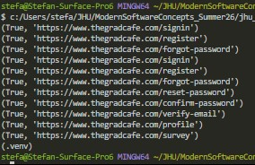

# Module 2 - Web Scraping

***Due Date***: May 31, 2026

## Personal Information
***Author:*** Stefan Thomas

***Hopkins ID:*** 6B9051

## Approach

### I completed this assignment in two phases:

1) Scrape, clean, and output the data stored on [thegradcafe.com](https://www.thegradcafe.com/survey) as a JSON file

    - The first step was to assess compliance with `robots.txt` file from `thegradcafe.com`
        - This was accomplished using `confirmRobot.confirm_robot()`
        - The robot.txt was examined, and the paths that marked as 'Disallow' were checked against
        - There are known bugs with the functionality.  See [Known Bugs](#Known-Bugs) for more information.
    - Using a thread pool, webpages are sent to different workers. Then, each worker scrapes, and then cleans the data by calling `scrapeData.scrape_data()` and `cleanData.clean_data()`, respectively
    - ***scrapeData.scrape_data(base_url, pageNum)***
        - with the inputs *base_url*, and *pageNum*, a webpage URL is generated
        - using urllib3.PoolManager(), send an HTTP request for the input webpage
        - html data is extracted and output
    - ***cleanData.clean_data(html_data, base_url)***
        - a BeautifulSoup object is instantiated and used to find all the html elements with the table row tag `<tr>`
        - Each table row element is then assessed if it's a new student entry, which was determined by examining the HTML document and finding the pattern **"div.tw-font-medium.tw-text-gray-900.tw-text-sm"**. This formatting pattern was used to format each 'university' data point, which indicated a new student entry
        - If this table row was indeed a new student entry, a new ***GradApplicant*** dataclass object was created and passed to subsequent functions for data extraction: *_parse_main_row()*, *_parse_details_row()*, *_parse_comment_row()*
            - *_parse_main_row()*
                - This function parses the main table row element that contains applicant data, such as the univeristy, program, degree type, date posted, status, and url
                - This data was extracted by examining the html for patterns and then using the BeautifulSoup methods of *row.select_one* and leveraging "nth-of-type" to extract pertinent data stored in table data elements `<td>`

            - *_parse_details_row()*
                - This function parses the next table row element, which, from examing the HTML, contained the following data points: semester, citizenship, gre scores, and gpa.
                - This data was extracted using regular expressions and pattern matching

            - *_parse_comment_row()*
                - This fucntion parsed the comment data, which was encapsulated by paragraph tags `
`
    
    - After extracting the pertinent data and storing it appropriately in a GradApplicant object, each GradApplicant object was stored in a list, and that list was converted to a JSON file using `saveData.save_data()`
---
2) Using the output JSON file from Step 1, pass it into the simple LLM provided to further enrich the JSON list for each applicant entry
    ### Changes to Instructor-Given LLM
    - A simple LLM was provided to better clean the data extracted from the webpages. A few changes needed to be made in order for this process to work more accurately:
        - Update the input to the LLM to include `university_text: str, program_text: str`. This was necessary because my input data was structured with the university first, followed by the program. Without this change, the LLM was producing blatantly wrong results for the university of the applicant.
        - Because of this necessary change to the input parameters, the `FEW_SHOTS` needed to be updated to accurately reflect that and provided some training data to the LLM
        - The rules for the LLM were also made more strict to allow for the LLM to write UNKNOWN if a field was indeterministic. They were also updated to reflect the change in the input to the LLM.
        - A new function ***enrich_row()*** was created to allow for parallelization

## Run Instructions
Within the `Module_2` folder, run `python runWebScraper.py`.

Refer to the `requirements.txt` to ensure you have the necessary packages and version of Python installed in your virtual environement.

## Output Files
**applicant_data.json**
- This JSON file contains 60000 grad applicants and their pertient data points. This is the output from scraping and cleaning the data.

**applicant_data_SMALL.json**
- This JSON file contains only 60 grad applicants. This file was generated from scraping and cleaning webpages, to then be passed into the LLM, which is NOT parallelized (see [Known Bugs](#Approach))

**llm_extended_applicant_data.json**
- This JSON file is the output from the LLM. Although this file only contains 60 applicants, it was provided as evidence that the LLM was working. It is, however, not parallelized, and I ran out of time to run the 60000 applicant JSON file through it.
- See [Known Bugs](#Known-Bugs) for more information.

## Known Bugs

- Currently, there is an issue when running the `confirmRobot.confirm_robot()` function. I was not able to diagnose why the robotParser 'can_fetch' the "Disallow" paths. This needs to be fixed to ensure compliance with `thegradcafe.com/robots.txt`. See the image below:

    

- The implementation for parallelization of the LLM is incorrect. I attempted to parallelize it, but I was getting issues while running. Currently, this process is threaded with simply 1 LLM worker (I'm not too confident that this is the correct approach). This code works, but it takes a long time to run and complete. I unfortunately ran out of time to produce a full LLM-fixed JSON file, so I simply scraped a few webpages and passed the output JSON file through the LLM to ensure accurate results. See [output files](#Output-Files) for more information.
    - I would greatly appreciate feedback on how to best implement the parallelization of the LLM. I have a feeling my thought process is incorrect, but I'm not sure.